# System Architecture

This document provides a comprehensive overview of the Agentic Hike Planner application architecture, including system design, Azure service integration, data flow patterns, and component relationships.

## Table of Contents

- [System Overview](#system-overview)
- [High-Level Architecture](#high-level-architecture)
- [Component Architecture](#component-architecture)
- [Azure Services Integration](#azure-services-integration)
- [Database Design](#database-design)
- [Authentication Flow](#authentication-flow)
- [Data Flow Patterns](#data-flow-patterns)
- [API Design](#api-design)
- [Frontend Architecture](#frontend-architecture)
- [Infrastructure & Deployment](#infrastructure--deployment)
- [Security Considerations](#security-considerations)
- [Scalability & Performance](#scalability--performance)

## System Overview

The Agentic Hike Planner is a modern, cloud-native web application built on Azure that helps outdoor enthusiasts discover, plan, and organize hiking adventures using AI-powered recommendations. The application follows a multi-tier architecture pattern with clear separation of concerns.

### Core Features
- **AI-Powered Trip Planning**: Intelligent hiking recommendations using Azure AI Foundry
- **User Management**: Secure authentication and personalized user profiles
- **Trip Organization**: Comprehensive trip planning and management capabilities
- **Trail Discovery**: Rich trail database with detailed characteristics and ratings
- **Real-time Recommendations**: Context-aware suggestions based on user preferences

### Technology Stack
- **Frontend**: React 19 + TypeScript + Vite + TailwindCSS
- **Backend**: Node.js + Express + TypeScript
- **Database**: Azure Cosmos DB (NoSQL)
- **AI/ML**: Azure AI Foundry + GPT-4o-mini
- **Cloud Platform**: Microsoft Azure
- **Infrastructure**: Azure Bicep + Terraform (IaC)

## High-Level Architecture

```mermaid
%%{init: {'theme':'base', 'themeVariables': { 'primaryColor': '#0078d4', 'primaryTextColor': '#fff', 'primaryBorderColor': '#106ebe', 'lineColor': '#0078d4', 'secondaryColor': '#40e0d0', 'tertiaryColor': '#87ceeb', 'background': '#ffffff', 'mainBkg': '#ffffff', 'secondBkg': '#f5f5f5', 'tertiaryBkg': '#e6f3ff'}}}%%
graph TB
    subgraph "User Layer"
        Users[🧗 Hiking Enthusiasts<br/>Web Browsers & Mobile]
    end
    
    subgraph "Azure Frontend"
        SWA[📱 Azure Static Web Apps<br/>React TypeScript SPA<br/>Built-in CDN & SSL]
    end
    
    subgraph "Azure Backend Services"
        ASP[💻 Azure App Service<br/>Node.js Express API<br/>RESTful Endpoints]
        
        subgraph "Azure AI & Cognitive Services"
            AIFO[🧠 Azure AI Foundry<br/>GPT-4o-mini<br/>Hiking Recommendations]
            CV[👁️ Computer Vision<br/>Trail Image Analysis]
        end
    end
    
    subgraph "Azure Data Services"
        COSMOS[🌍 Azure Cosmos DB<br/>NoSQL Database<br/>Global Distribution]
        BLOB[💾 Azure Blob Storage<br/>Trail Images & Documents<br/>Lifecycle Management]
    end
    
    subgraph "Azure Identity & Security"
        B2C[🔐 Azure AD B2C<br/>User Authentication<br/>Identity Management]
        KV[🔑 Azure Key Vault<br/>Secrets Management<br/>Certificates & Keys]
    end
    
    subgraph "Azure Monitoring & Operations"
        AI[📊 Application Insights<br/>Performance Monitoring<br/>Telemetry & Analytics]
        MON[📈 Azure Monitor<br/>Resource Monitoring<br/>Alerts & Diagnostics]
    end
    
    %% User interactions
    Users --> SWA
    
    %% Frontend to Backend
    SWA --> ASP
    SWA --> B2C
    
    %% Backend integrations
    ASP --> COSMOS
    ASP --> BLOB
    ASP --> AIFO
    ASP --> CV
    ASP --> B2C
    ASP --> KV
    
    %% Monitoring
    SWA --> AI
    ASP --> AI
    COSMOS --> MON
    BLOB --> MON
    ASP --> MON
    
    %% Styling
    classDef frontend fill:#e1f5fe,stroke:#0277bd,stroke-width:2px
    classDef backend fill:#f3e5f5,stroke:#7b1fa2,stroke-width:2px
    classDef data fill:#e8f5e8,stroke:#2e7d32,stroke-width:2px
    classDef security fill:#fff3e0,stroke:#f57c00,stroke-width:2px
    classDef monitoring fill:#fce4ec,stroke:#c2185b,stroke-width:2px
    classDef ai fill:#e0f2f1,stroke:#00695c,stroke-width:2px
    
    class SWA frontend
    class ASP backend
    class COSMOS,BLOB data
    class B2C,KV security
    class AI,MON monitoring
    class AIFO,CV ai
```



## Component Architecture

### Frontend Components (React SPA)


### Backend API Structure

```mermaid
%%{init: {'theme':'base', 'themeVariables': { 'primaryColor': '#68d391', 'primaryTextColor': '#000', 'primaryBorderColor': '#38a169', 'lineColor': '#68d391', 'secondaryColor': '#4299e1', 'tertiaryColor': '#ed8936'}}}%%
graph TB
    subgraph "Express.js API Architecture"
        Server[server.ts<br/>Application Entry Point<br/>Express Server Setup]
        
        subgraph "Middleware Layer"
            Auth[auth.ts<br/>Authentication Middleware<br/>Azure AD B2C Validation]
            Validate[validation.ts<br/>Request Validation<br/>Joi Schema Validation]
            Error[errorHandler.ts<br/>Error Handling<br/>Centralized Error Processing]
            Logging[logging.ts<br/>Request Logging<br/>Correlation IDs]
            CORS[CORS Middleware<br/>Cross-Origin Requests]
            Security[Security Middleware<br/>Helmet + Rate Limiting]
        end
        
        subgraph "Route Handlers"
            AuthRoutes[/auth<br/>Authentication Routes<br/>Login, Logout, Profile]
            TripRoutes[/trips<br/>Trip Management<br/>CRUD Operations]
            TrailRoutes[/trails<br/>Trail Discovery<br/>Search & Filtering]
            RecommendRoutes[/recommendations<br/>AI Recommendations<br/>Trip Suggestions]
            UserRoutes[/users<br/>User Management<br/>Profile & Preferences]
            HealthRoutes[/health<br/>Health Checks<br/>System Status]
        end
        
        subgraph "Controllers"
            AuthController[AuthController<br/>Authentication Logic]
            TripController[TripController<br/>Trip Business Logic]
            TrailController[TrailController<br/>Trail Management]
            RecommendController[RecommendController<br/>AI Integration Logic]
            UserController[UserController<br/>User Operations]
        end
        
        subgraph "Services Layer"
            DatabaseService[DatabaseService<br/>Cosmos DB Integration<br/>Container Management]
            AIService[AIService<br/>Azure AI Foundry<br/>GPT Integration]
            StorageService[StorageService<br/>Blob Storage<br/>File Management]
            AuthService[AuthService<br/>Azure AD B2C<br/>Token Validation]
        end
        
        subgraph "Data Layer"
            Repositories[Repository Pattern<br/>Data Access Objects<br/>CRUD Abstraction]
            Models[Data Models<br/>TypeScript Interfaces<br/>Validation Schemas]
        end
    end
    
    Server --> Auth
    Server --> Validate
    Server --> Error
    Server --> Logging
    Server --> CORS
    Server --> Security
    
    Server --> AuthRoutes
    Server --> TripRoutes
    Server --> TrailRoutes
    Server --> RecommendRoutes
    Server --> UserRoutes
    Server --> HealthRoutes
    
    AuthRoutes --> AuthController
    TripRoutes --> TripController
    TrailRoutes --> TrailController
    RecommendRoutes --> RecommendController
    UserRoutes --> UserController
    
    AuthController --> DatabaseService
    TripController --> DatabaseService
    TrailController --> DatabaseService
    RecommendController --> AIService
    UserController --> DatabaseService
    
    DatabaseService --> Repositories
    AIService --> Repositories
    StorageService --> Repositories
    AuthService --> Repositories
    
    Repositories --> Models
    
    classDef middleware fill:#fff2cc,stroke:#d6b656,stroke-width:2px
    classDef routes fill:#d5e8d4,stroke:#82b366,stroke-width:2px
    classDef controllers fill:#dae8fc,stroke:#6c8ebf,stroke-width:2px
    classDef services fill:#f8cecc,stroke:#b85450,stroke-width:2px
    classDef data fill:#e1d5e7,stroke:#9673a6,stroke-width:2px
    
    class Auth,Validate,Error,Logging,CORS,Security middleware
    class AuthRoutes,TripRoutes,TrailRoutes,RecommendRoutes,UserRoutes,HealthRoutes routes
    class AuthController,TripController,TrailController,RecommendController,UserController controllers
    class DatabaseService,AIService,StorageService,AuthService services
    class Repositories,Models data
```

## Azure Services Integration

### Service Integration Pattern


### Azure Service Configuration

| Service | Configuration | Purpose | Scaling Strategy |
|---------|---------------|---------|------------------|
| **Static Web Apps** | Standard tier, Custom domain, GitHub integration | Frontend hosting with global CDN | Automatic global distribution |
| **App Service** | Basic B2 plan, Auto-scaling enabled, Health checks | Backend API hosting | Horizontal auto-scaling based on CPU/memory |
| **Cosmos DB** | SQL API, Serverless billing, Multi-region replication | Primary data store | Auto-scaling RU/s, global distribution |
| **AI Foundry** | GPT-4o-mini model, Pay-per-use billing | AI recommendations | Managed scaling by Azure |
| **Blob Storage** | Hot/Cool/Archive tiers, Lifecycle policies | File storage | Automatic tier management |
| **AD B2C** | Free tier, Social providers, Custom policies | User authentication | Managed service with high availability |
| **Key Vault** | Standard tier, Access policies, Soft delete | Secret management | Managed service with geo-redundancy |
| **Application Insights** | 1GB/day retention, Custom metrics | Application monitoring | Sampling and data retention policies |

## Database Design

### Cosmos DB Container Architecture


### Data Model Relationships


### Indexing Strategy

| Container | Partition Key | Indexed Properties | Query Patterns |
|-----------|---------------|-------------------|----------------|
| **users** | `/partitionKey` (user-{id}) | email, fitnessLevel, location.region, createdAt | User lookup, fitness matching, location-based queries |
| **trips** | `/partitionKey` (user-{userId}) | userId, status, dates.startDate, dates.endDate, location.region | User's trips, status filtering, date range queries |
| **trails** | `/partitionKey` (region-based) | characteristics.difficulty, characteristics.distance, location.region, ratings.average | Trail search, difficulty filtering, geographic queries |
| **recommendations** | `/partitionKey` (user-{userId}) | userId, tripId, confidence, createdAt, expiresAt | User recommendations, trip-specific suggestions, cleanup queries |

## Authentication Flow

### Azure AD B2C Integration

```mermaid
%%{init: {'theme':'base', 'themeVariables': { 'primaryColor': '#ff6b35', 'primaryTextColor': '#fff', 'primaryBorderColor': '#e55a2b', 'lineColor': '#ff6b35', 'secondaryColor': '#4ecdc4', 'tertiaryColor': '#45b7d1'}}}%%
sequenceDiagram
    participant User as 🧗 User
    participant SWA as 📱 Static Web App
    participant B2C as 🔐 Azure AD B2C
    participant API as 💻 Backend API
    participant DB as 🌍 Cosmos DB
    
    Note over User,DB: User Registration/Login Flow
    
    User->>SWA: 1. Access Application
    SWA->>B2C: 2. Redirect to B2C Login
    B2C->>User: 3. Present Login Options<br/>(Social + Email)
    User->>B2C: 4. Authenticate
    B2C->>B2C: 5. Validate Credentials
    B2C->>SWA: 6. Return JWT Token + User Info
    SWA->>SWA: 7. Store Token (Secure Storage)
    
    Note over User,DB: API Request Flow
    
    SWA->>API: 8. API Request<br/>Authorization: Bearer {token}
    API->>API: 9. Extract & Validate JWT
    API->>B2C: 10. Verify Token Signature<br/>(if needed)
    B2C->>API: 11. Token Valid Response
    API->>API: 12. Extract User Claims
    API->>DB: 13. Query User Data<br/>partitionKey: user-{id}
    DB->>API: 14. Return User Profile
    API->>SWA: 15. Return API Response<br/>+ User Context
    SWA->>User: 16. Display Personalized Content
    
    Note over User,DB: Token Refresh Flow
    
    SWA->>SWA: 17. Token Near Expiry
    SWA->>B2C: 18. Silent Token Refresh
    B2C->>SWA: 19. New JWT Token
    SWA->>SWA: 20. Update Stored Token
```



### Authentication Middleware Implementation

The backend API implements a layered authentication approach:

1. **Development Mode**: Mock authentication for local development
2. **Production Mode**: Full Azure AD B2C token validation
3. **Optional Authentication**: Routes that work with or without authentication

```typescript
// Authentication flow in Express middleware
export const authenticateToken = (req, res, next) => {
  // Development: Mock user if no token
  if (config.nodeEnv === 'development' && !authHeader) {
    req.user = mockUser;
    return next();
  }
  
  // Production: Validate JWT token with Azure AD B2C
  const token = extractBearerToken(authHeader);
  validateAzureB2CToken(token)
    .then(claims => {
      req.user = {
        id: claims.sub,
        email: claims.email,
        name: claims.name
      };
      next();
    })
    .catch(error => next(createError('Invalid token', 403)));
};
```

## Data Flow Patterns

### Complete Request-Response Cycle

```mermaid
%%{init: {'theme':'base', 'themeVariables': { 'primaryColor': '#8e44ad', 'primaryTextColor': '#fff', 'primaryBorderColor': '#7d3c98', 'lineColor': '#8e44ad', 'secondaryColor': '#3498db', 'tertiaryColor': '#2ecc71'}}}%%
sequenceDiagram
    participant User as 🧗 User Browser
    participant CDN as 🌐 Static Web App CDN
    participant React as ⚛️ React Application
    participant API as 🛠️ Express API
    participant Auth as 🔐 Auth Middleware
    participant Controller as 🎛️ Controller
    participant Service as ⚙️ Service Layer
    participant Cosmos as 🌍 Cosmos DB
    participant AI as 🧠 AI Foundry
    participant Blob as 💾 Blob Storage
    participant Insights as 📊 App Insights
    
    Note over User,Insights: AI Trip Planning Flow Example
    
    User->>CDN: 1. Request trip planning page
    CDN->>React: 2. Serve React SPA
    React->>User: 3. Render trip planning UI
    
    User->>React: 4. Submit trip preferences
    React->>React: 5. Validate form data
    React->>API: 6. POST /api/recommendations<br/>Authorization: Bearer {token}
    
    API->>Auth: 7. Validate JWT token
    Auth->>API: 8. User authenticated
    API->>Controller: 9. Route to recommendation controller
    
    Controller->>Controller: 10. Validate request schema
    Controller->>Service: 11. Call recommendation service
    
    parallel
        Service->>Cosmos: 12a. Query user preferences
        Service->>Cosmos: 12b. Query existing trips
        Service->>Cosmos: 12c. Search relevant trails
    and
        Cosmos->>Service: 13a. Return user data
        Cosmos->>Service: 13b. Return trip history
        Cosmos->>Service: 13c. Return trail matches
    end
    
    Service->>AI: 14. Generate recommendations<br/>with context data
    AI->>Service: 15. Return AI suggestions
    
    Service->>Cosmos: 16. Store recommendation<br/>(with TTL)
    Service->>Blob: 17. Fetch trail images
    Blob->>Service: 18. Return image URLs
    
    Service->>Controller: 19. Return enriched data
    Controller->>API: 20. Format response
    
    API->>Insights: 21. Log performance metrics
    API->>React: 22. Return JSON response
    React->>React: 23. Update component state
    React->>User: 24. Display recommendations
    
    Note over User,Insights: Error Handling & Monitoring
    
    alt Error Occurs
        Service->>Insights: Log error details
        Service->>Controller: Throw formatted error
        Controller->>API: Return error response
        API->>React: HTTP error status
        React->>User: Display user-friendly error
    end
```

### State Management Flow (Frontend)


## API Design

### RESTful Endpoint Structure

| Endpoint | Method | Purpose | Request Body | Response |
|----------|--------|---------|--------------|----------|
| **Authentication** |
| `/api/auth/profile` | GET | Get user profile | - | User object |
| `/api/auth/preferences` | PUT | Update preferences | UserPreferences | Updated user |
| **Trip Management** |
| `/api/trips` | GET | List user trips | - | Trip[] |
| `/api/trips` | POST | Create new trip | CreateTripRequest | Trip |
| `/api/trips/:id` | GET | Get trip details | - | Trip |
| `/api/trips/:id` | PUT | Update trip | UpdateTripRequest | Trip |
| `/api/trips/:id` | DELETE | Delete trip | - | - |
| **Trail Discovery** |
| `/api/trails` | GET | Search trails | Query params | Trail[] |
| `/api/trails/:id` | GET | Get trail details | - | Trail |
| `/api/trails/nearby` | GET | Find nearby trails | lat, lng, radius | Trail[] |
| **AI Recommendations** |
| `/api/recommendations` | POST | Get recommendations | RecommendationRequest | Recommendation[] |
| `/api/recommendations/:tripId` | GET | Get trip recommendations | - | Recommendation[] |
| **Health & Monitoring** |
| `/api/health` | GET | System health check | - | HealthStatus |
| `/api/health/db` | GET | Database health | - | DatabaseStatus |

### API Response Patterns

#### Standard Success Response
```typescript
interface APIResponse<T> {
  success: true;
  data: T;
  metadata?: {
    timestamp: string;
    requestId: string;
    version: string;
  };
}
```

#### Standard Error Response
```typescript
interface APIError {
  success: false;
  error: {
    code: string;
    message: string;
    details?: any;
  };
  metadata: {
    timestamp: string;
    requestId: string;
    correlationId: string;
  };
}
```

#### Paginated Response
```typescript
interface PaginatedResponse<T> {
  success: true;
  data: T[];
  pagination: {
    page: number;
    limit: number;
    total: number;
    hasNext: boolean;
    hasPrev: boolean;
  };
}
```

## Frontend Architecture

### React Application Structure

The frontend follows a modern React architecture with TypeScript, emphasizing component composition, custom hooks for logic reuse, and efficient state management.

#### Key Technologies & Patterns

- **React 19**: Latest React features with concurrent rendering
- **TypeScript**: Full type safety across the application
- **Vite**: Fast build tool with HMR (Hot Module Replacement)
- **TailwindCSS**: Utility-first CSS framework for rapid UI development
- **Headless UI**: Unstyled, accessible UI components
- **React Query**: Server state management with caching and synchronization
- **Zustand**: Lightweight state management for client state
- **React Hook Form**: Performant forms with easy validation
- **Axios**: Promise-based HTTP client with interceptors

#### Component Architecture Principles

1. **Composition over Inheritance**: Small, reusable components that compose together
2. **Container/Presentational Pattern**: Separation of data logic and UI rendering
3. **Custom Hooks**: Business logic extraction for reusability and testing
4. **TypeScript-First**: Comprehensive type definitions for all props and data
5. **Accessibility**: WCAG compliance through Headless UI and semantic HTML

#### State Management Strategy

- **Server State**: React Query handles all server communication, caching, and synchronization
- **Client State**: Zustand manages user preferences, app settings, and UI state
- **Form State**: React Hook Form for form-specific state and validation
- **Local Component State**: React useState for component-specific UI state

## Infrastructure & Deployment

### Infrastructure as Code (IaC)

The application supports two IaC approaches for maximum flexibility:

#### Azure Bicep Templates
```
infrastructure/bicep/
├── main.bicep              # Main orchestration template
├── modules/
│   ├── storage.bicep       # Blob storage and CDN
│   ├── database.bicep      # Cosmos DB configuration
│   ├── compute.bicep       # App Service plans and apps
│   ├── identity.bicep      # Azure AD B2C setup
│   ├── ai.bicep           # AI Foundry and Cognitive Services
│   └── monitoring.bicep    # Application Insights and monitoring
└── parameters/
    ├── dev.json           # Development environment parameters
    ├── staging.json       # Staging environment parameters
    └── prod.json          # Production environment parameters
```

#### Terraform Configuration
```
infrastructure/terraform/
├── main.tf                # Main configuration
├── variables.tf           # Input variables
├── outputs.tf             # Output values
├── modules/
│   ├── frontend/          # Static Web Apps module
│   ├── backend/           # App Service module
│   ├── database/          # Cosmos DB module
│   ├── identity/          # Azure AD B2C module
│   └── monitoring/        # Monitoring stack module
└── environments/
    ├── dev.tfvars         # Development variables
    ├── staging.tfvars     # Staging variables
    └── prod.tfvars        # Production variables
```

### Deployment Architecture


### CI/CD Pipeline

The application uses GitHub Actions for continuous integration and deployment:

#### Frontend Pipeline (Static Web Apps)
1. **Build**: Vite build with TypeScript compilation
2. **Test**: Component tests with Vitest
3. **Lint**: ESLint validation
4. **Deploy**: Automatic deployment to Azure Static Web Apps
5. **E2E Tests**: Playwright tests against deployed application

#### Backend Pipeline (App Service)
1. **Build**: TypeScript compilation to JavaScript
2. **Test**: Jest unit and integration tests
3. **Lint**: ESLint and TypeScript strict checks
4. **Security Scan**: NPM audit and dependency checks
5. **Docker Build**: Container image creation
6. **Deploy**: Blue-green deployment to Azure App Service
7. **Health Check**: Automated API health verification

#### Infrastructure Pipeline
1. **Validate**: Bicep/Terraform validation
2. **Plan**: Infrastructure change preview
3. **Apply**: Resource provisioning/updates
4. **Test**: Infrastructure validation tests
5. **Monitor**: Resource health checks

## Security Considerations

### Application Security

1. **Authentication & Authorization**
   - Azure AD B2C for user authentication
   - JWT token validation on all protected endpoints
   - Role-based access control (future enhancement)
   - Multi-factor authentication support

2. **Data Protection**
   - HTTPS enforcement across all services
   - Data encryption at rest (Cosmos DB automatic encryption)
   - Data encryption in transit (TLS 1.2+)
   - Personal data anonymization for analytics

3. **API Security**
   - Request rate limiting (15 min windows, 100 requests/IP)
   - Input validation using Joi schemas
   - CORS configuration for allowed origins
   - Security headers via Helmet.js
   - SQL injection prevention (parameterized queries)

4. **Secret Management**
   - Azure Key Vault for all sensitive configuration
   - Environment-specific secret isolation
   - Automatic secret rotation policies
   - No secrets in source code or configuration files

5. **Network Security**
   - Azure services communication over private endpoints
   - Web Application Firewall (WAF) via Application Gateway
   - Network Security Groups (NSGs) for traffic filtering
   - DDoS protection at the Azure platform level

### Compliance & Privacy

- **GDPR Compliance**: User data portability and deletion rights
- **Data Residency**: Configurable geographic data storage
- **Audit Logging**: Comprehensive activity logging for compliance
- **Privacy Controls**: User consent management and data minimization

## Scalability & Performance

### Horizontal Scaling Strategy

1. **Frontend Scaling**
   - Global CDN distribution via Azure Static Web Apps
   - Edge caching for static assets
   - Progressive web app (PWA) capabilities
   - Code splitting and lazy loading

2. **Backend Scaling**
   - Azure App Service auto-scaling based on CPU/memory metrics
   - Horizontal scaling up to 10 instances (configurable)
   - Application-level caching for frequently accessed data
   - Database connection pooling

3. **Database Scaling**
   - Cosmos DB serverless billing with automatic scaling
   - Global distribution for read replicas
   - Partition strategy optimization for query performance
   - Automatic indexing with custom index policies

4. **AI Service Scaling**
   - Managed scaling via Azure AI Foundry
   - Request queuing and retry logic
   - Response caching for similar requests
   - Rate limiting to manage costs

### Performance Optimization

1. **Frontend Performance**
   - React Query for intelligent data caching
   - Component memoization with React.memo
   - Virtual scrolling for large lists
   - Image optimization and lazy loading
   - Bundle size optimization with tree shaking

2. **Backend Performance**
   - Response compression (gzip)
   - Database query optimization
   - Connection pooling
   - Background job processing for long-running tasks
   - Async/await patterns for non-blocking operations

3. **Database Performance**
   - Optimized partition key strategy
   - Selective property indexing
   - Query result caching
   - TTL (Time To Live) for temporary data
   - Batch operations for bulk updates

### Monitoring & Alerting

1. **Application Monitoring**
   - Real-time performance metrics via Application Insights
   - Custom telemetry for business metrics
   - Error tracking and exception monitoring
   - User session analytics

2. **Infrastructure Monitoring**
   - Azure Monitor for resource utilization
   - Custom dashboards for key metrics
   - Automated alerting for threshold breaches
   - Log aggregation and analysis

3. **Performance Metrics**
   - API response times and throughput
   - Database query performance
   - AI service response times
   - User experience metrics (Core Web Vitals)

---

## Conclusion

The Agentic Hike Planner demonstrates a comprehensive, modern cloud-native architecture that leverages Azure's managed services to deliver a scalable, secure, and maintainable application. The architecture emphasizes:

- **Developer Experience**: TypeScript-first development with comprehensive tooling
- **Scalability**: Auto-scaling capabilities across all tiers
- **Security**: Zero-trust architecture with comprehensive security controls
- **Maintainability**: Clean separation of concerns and Infrastructure as Code
- **Cost Optimization**: Serverless and consumption-based billing where appropriate
- **Observability**: Comprehensive monitoring and alerting across all components

This architecture serves as a foundation for rapid development and iteration while maintaining enterprise-grade reliability and security standards.