# System Architecture

This document provides a focused overview of the Agentic Hike Planner application architecture, designed for clarity and accessibility.

## Table of Contents

- [System Overview](#system-overview)
- [High-Level Architecture](#high-level-architecture)
- [Component Architecture](#component-architecture)
- [Database Design](#database-design)
- [Authentication Flow](#authentication-flow)
- [API Design](#api-design)
- [Deployment](#deployment)

## System Overview

The Agentic Hike Planner is a cloud-native web application built on Azure that helps hiking enthusiasts discover and plan outdoor adventures using AI-powered recommendations.

### Core Features
- **AI-Powered Planning**: Intelligent hiking recommendations using Azure AI
- **User Management**: Secure authentication and personalized profiles
- **Trip Organization**: Comprehensive trip planning and management
- **Trail Discovery**: Rich trail database with detailed information

### Technology Stack
- **Frontend**: React 19 + TypeScript + Vite + TailwindCSS
- **Backend**: Node.js + Express + TypeScript
- **Database**: Azure Cosmos DB (NoSQL)
- **AI/ML**: Azure AI Foundry
- **Cloud Platform**: Microsoft Azure

## High-Level Architecture

```mermaid
%%{init: {
    'theme': 'base',
    'themeVariables': {
        'primaryColor': '#0078d4',
        'primaryTextColor': '#000000',
        'primaryBorderColor': '#004578',
        'lineColor': '#0078d4',
        'secondaryColor': '#40e0d0',
        'tertiaryColor': '#87ceeb',
        'background': '#ffffff',
        'mainBkg': '#f8f9fa',
        'secondBkg': '#e9ecef',
        'fontFamily': 'system-ui, -apple-system, sans-serif',
        'fontSize': '14px'
    }
}}%%
graph TB
    subgraph "User Interface"
        Users["👥 Users<br/>Web Browsers"]
    end
    
    subgraph "Frontend Layer"
        SWA["📱 Azure Static Web Apps<br/>React TypeScript SPA"]
    end
    
    subgraph "Backend Services"
        API["🔧 Azure App Service<br/>Node.js Express API"]
        AI["🧠 Azure AI Foundry<br/>GPT-4o-mini"]
    end
    
    subgraph "Data Layer"
        DB["🗄️ Azure Cosmos DB<br/>NoSQL Database"]
        Storage["💾 Azure Blob Storage<br/>Files & Images"]
    end
    
    subgraph "Security & Identity"
        Auth["🔐 Azure AD B2C<br/>Authentication"]
        Vault["🔑 Azure Key Vault<br/>Secrets Management"]
    end
    
    subgraph "Monitoring"
        Monitor["📊 Application Insights<br/>Monitoring & Analytics"]
    end
    
    %% Connections
    Users --> SWA
    SWA --> API
    SWA --> Auth
    API --> DB
    API --> Storage
    API --> AI
    API --> Auth
    API --> Vault
    
    %% Monitoring connections
    SWA --> Monitor
    API --> Monitor
    
    %% Accessible styling
    classDef userLayer fill:#e1f5fe,stroke:#01579b,stroke-width:2px,color:#000000
    classDef frontendLayer fill:#f3e5f5,stroke:#4a148c,stroke-width:2px,color:#000000
    classDef backendLayer fill:#e8f5e8,stroke:#1b5e20,stroke-width:2px,color:#000000
    classDef dataLayer fill:#fff3e0,stroke:#e65100,stroke-width:2px,color:#000000
    classDef securityLayer fill:#fce4ec,stroke:#880e4f,stroke-width:2px,color:#000000
    classDef monitorLayer fill:#e0f2f1,stroke:#004d40,stroke-width:2px,color:#000000
    
    class Users userLayer
    class SWA frontendLayer
    class API,AI backendLayer
    class DB,Storage dataLayer
    class Auth,Vault securityLayer
    class Monitor monitorLayer
```



## Component Architecture

### Frontend Structure


### Backend Structure


## Database Design

### Cosmos DB Container Structure


## Authentication Flow

```mermaid
%%{init: {
    'theme': 'base',
    'themeVariables': {
        'primaryColor': '#9c27b0',
        'primaryTextColor': '#000000',
        'primaryBorderColor': '#4a148c',
        'lineColor': '#7b1fa2',
        'secondaryColor': '#00bcd4',
        'tertiaryColor': '#4caf50',
        'background': '#ffffff',
        'mainBkg': '#f8f9fa',
        'fontFamily': 'system-ui, -apple-system, sans-serif',
        'fontSize': '14px'
    }
}}%%
sequenceDiagram
    participant User as 👤 User
    participant App as 📱 React App
    participant B2C as 🔐 Azure AD B2C
    participant API as 🔧 API Server
    participant DB as 🗄️ Cosmos DB
    
    Note over User,DB: User Authentication Flow
    
    User->>App: Access Protected Route
    App->>B2C: Redirect to Login
    B2C->>User: Present Login Form
    User->>B2C: Submit Credentials
    B2C->>App: Return JWT Token
    App->>API: API Call with JWT
    API->>B2C: Validate Token
    B2C->>API: Token Valid
    API->>DB: Query User Data
    DB->>API: Return User Info
    API->>App: Protected Data
    App->>User: Display Content
    
    Note over User,DB: Secure data access established
```



## API Design

### RESTful Endpoints

The API follows REST principles with consistent patterns:

**Base URL**: `https://api.hikeplanner.com/v1`

#### Core Endpoints

| Method | Endpoint | Description | Auth Required |
|--------|----------|-------------|---------------|
| `GET` | `/users/profile` | Get user profile | ✅ |
| `PUT` | `/users/profile` | Update profile | ✅ |
| `GET` | `/trips` | List user trips | ✅ |
| `POST` | `/trips` | Create new trip | ✅ |
| `GET` | `/trips/{id}` | Get trip details | ✅ |
| `PUT` | `/trips/{id}` | Update trip | ✅ |
| `DELETE` | `/trips/{id}` | Delete trip | ✅ |
| `GET` | `/trails` | Search trails | ❌ |
| `GET` | `/trails/{id}` | Get trail details | ❌ |
| `POST` | `/recommendations` | Get AI recommendations | ✅ |

#### Request/Response Patterns

**Successful Response**:
```json
{
  "success": true,
  "data": { ... },
  "message": "Operation completed successfully"
}
```

**Error Response**:
```json
{
  "success": false,
  "error": {
    "code": "VALIDATION_ERROR",
    "message": "Invalid input data",
    "details": { ... }
  }
}
```

## Deployment

### Infrastructure Overview

The application uses Azure services with Infrastructure as Code (IaC) for consistent deployments:

```mermaid
%%{init: {
    'theme': 'base',
    'themeVariables': {
        'primaryColor': '#607d8b',
        'primaryTextColor': '#000000',
        'primaryBorderColor': '#263238',
        'lineColor': '#455a64',
        'secondaryColor': '#ff5722',
        'tertiaryColor': '#4caf50',
        'background': '#ffffff',
        'mainBkg': '#f8f9fa',
        'fontFamily': 'system-ui, -apple-system, sans-serif',
        'fontSize': '14px'
    }
}}%%
graph TB
    subgraph "Development"
        Dev["👨‍💻 Developer<br/>Local Development"]
        GitHub["📚 GitHub<br/>Version Control"]
    end
    
    subgraph "CI/CD Pipeline"
        Actions["⚙️ GitHub Actions<br/>Build & Test"]
        Deploy["🚀 Automated Deployment<br/>Azure Resources"]
    end
    
    subgraph "Azure Environment"
        SWA["📱 Static Web Apps<br/>Frontend Hosting"]
        AppService["🔧 App Service<br/>API Backend"]
        Cosmos["🗄️ Cosmos DB<br/>Database"]
        AI["🧠 AI Foundry<br/>ML Services"]
    end
    
    subgraph "Monitoring"
        Insights["📊 Application Insights<br/>Performance Monitoring"]
        Alerts["🚨 Azure Alerts<br/>Health Monitoring"]
    end
    
    %% Flow
    Dev --> GitHub
    GitHub --> Actions
    Actions --> Deploy
    Deploy --> SWA
    Deploy --> AppService
    Deploy --> Cosmos
    Deploy --> AI
    
    SWA --> Insights
    AppService --> Insights
    Insights --> Alerts
    
    %% Accessible styling
    classDef devLayer fill:#e8eaf6,stroke:#283593,stroke-width:2px,color:#000000
    classDef cicdLayer fill:#e0f2f1,stroke:#00695c,stroke-width:2px,color:#000000
    classDef azureLayer fill:#e3f2fd,stroke:#0d47a1,stroke-width:2px,color:#000000
    classDef monitorLayer fill:#fff3e0,stroke:#e65100,stroke-width:2px,color:#000000
    
    class Dev,GitHub devLayer
    class Actions,Deploy cicdLayer
    class SWA,AppService,Cosmos,AI azureLayer
    class Insights,Alerts monitorLayer
```



### Environment Configuration

- **Development**: Local development with Azure Cosmos DB Emulator
- **Staging**: Full Azure environment for testing
- **Production**: Scaled Azure resources with high availability

### Key Azure Services

1. **Azure Static Web Apps**: Frontend hosting with built-in CI/CD
2. **Azure App Service**: Backend API hosting with auto-scaling
3. **Azure Cosmos DB**: NoSQL database with global distribution
4. **Azure AI Foundry**: AI/ML services for recommendations
5. **Azure AD B2C**: User authentication and identity management
6. **Application Insights**: Monitoring and analytics

---

## Architecture Principles

### Design Principles
- **Simplicity**: Start simple, scale as needed
- **Separation of Concerns**: Clear boundaries between components
- **Type Safety**: TypeScript throughout the stack
- **Accessibility**: WCAG-compliant user interfaces
- **Performance**: Optimized for speed and efficiency

### Security Considerations
- **Authentication**: Azure AD B2C integration
- **Authorization**: Role-based access control
- **Data Protection**: Encryption at rest and in transit
- **Secret Management**: Azure Key Vault for sensitive data
- **Network Security**: VNet integration and private endpoints

### Scalability Strategy
- **Horizontal Scaling**: Auto-scaling for App Service
- **Database Scaling**: Cosmos DB global distribution
- **CDN**: Azure CDN for static assets
- **Caching**: Multi-level caching strategy
- **Load Balancing**: Azure Load Balancer for high availability

This architecture provides a solid foundation for the Agentic Hike Planner while maintaining simplicity and focus on core functionality.