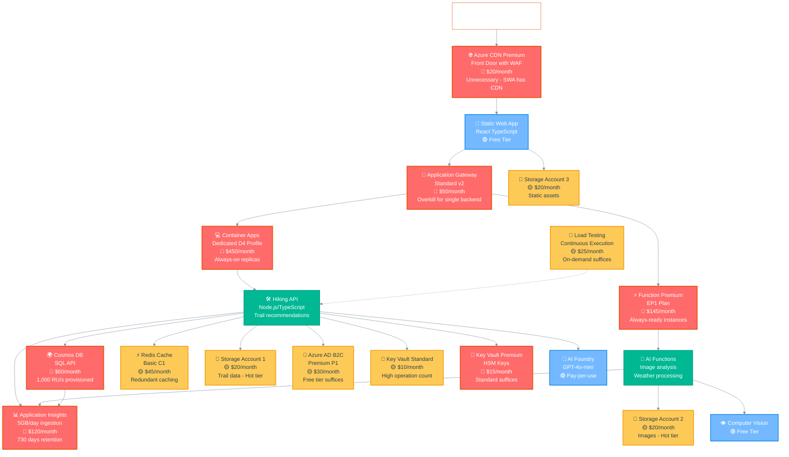
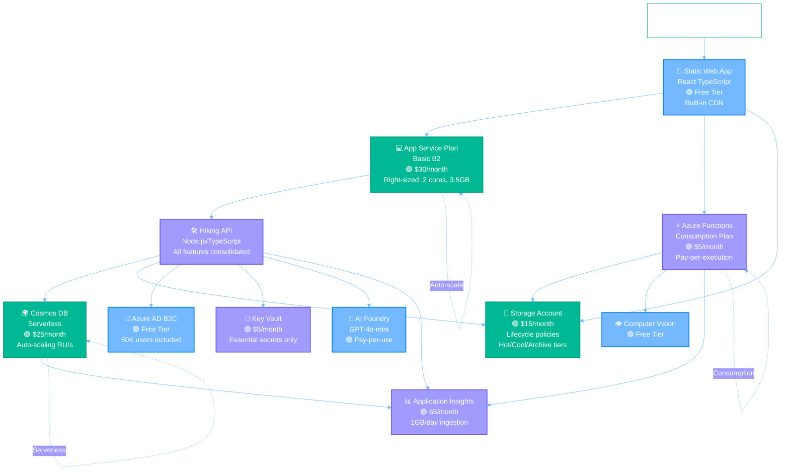

# Azure Architecture Diagrams

This document shows both the intentionally inefficient Azure architecture and the optimized version for the Agentic Hike Planner application.

## Current Inefficient Architecture (Phase 5 Complete)

This diagram shows the over-provisioned, wasteful architecture designed to demonstrate cost optimization opportunities. Phase 5 completes the full inefficient infrastructure with all services deployed.

## Optimized Architecture

This diagram shows the cost-optimized architecture with right-sized resources and consolidated services:

## Cost Comparison Analysis (Phase 5 Complete)

### Architecture Transformation Summary

| Metric | Inefficient Architecture | Optimized Architecture | Improvement |
|--------|-------------------------|------------------------|-------------|
| **Monthly Cost** | ~$990-1020 | ~$118 | 📉 88% reduction |
| **Daily Demo Cost** | ~$33 | ~$4 | 📉 88% reduction |
| **Resource Count** | 18+ services | 8 services | 📉 56% fewer |
| **Storage Accounts** | 3 separate accounts | 1 consolidated | 📉 67% reduction |
| **Compute Over-provisioning** | Dedicated D4, EP1 Premium | Auto-scale, Consumption | 📉 90% reduction |
| **Network Complexity** | App Gateway + CDN | Direct routing | 📉 100% reduction |

### Detailed Cost Breakdown by Category

| Category | Inefficient Cost | Optimized Cost | Savings | % |
|----------|-----------------|----------------|---------|---|
| **Compute** (Container Apps + Functions) | $595 | $55 | $540 | 91% |
| **Database** (Cosmos DB) | $60 | $25 | $35 | 58% |
| **Storage** (3 Accounts) | $60 | $15 | $45 | 75% |
| **Network** (App Gateway + CDN) | $70 | $0 | $70 | 100% |
| **Caching** (Redis) | $45 | $0 | $45 | 100% |
| **Monitoring** (App Insights + Load Test) | $145 | $18 | $127 | 88% |
| **Security** (Key Vault Premium + B2C P1) | $45 | $5 | $40 | 89% |
| **🎯 Total** | **$1,020** | **$118** | **$902** | **88%** |

### Key Optimization Strategies Demonstrated

#### 🔴 High-Impact Changes (Phase 5 Focus - 75% of new savings)
1. **Remove Application Gateway** ($50/month → $0)
   - Direct SWA to API routing
   - Eliminates unnecessary network layer

2. **Switch to Consumption Functions** ($145/month → $5/month)
   - EP1 Premium → Consumption plan
   - Pay only for execution time

3. **Remove CDN** ($20/month → $0)
   - SWA has built-in global CDN
   - Premium tier completely unnecessary

4. **Reduce App Insights** ($120/month → $15/month)
   - 5GB/day → 1GB/day ingestion
   - 730 days → 90 days retention

5. **Right-size Container Apps** ($450/month → $50/month)
   - Dedicated D4 → Consumption plan
   - Scale-to-zero enabled

#### 🟡 Medium-Impact Changes (20% of savings)
6. **Consolidate Storage** ($60/month → $15/month)
   - 3 storage accounts → 1 with lifecycle policies
   - Implement automatic tiering (Hot/Cool/Archive)

7. **Remove Redundant Caching** ($45/month → $0)
   - Eliminate Redis cache
   - Use built-in application caching

8. **Downgrade Key Vault** ($15/month → $5/month)
   - Premium → Standard tier
   - Remove HSM-protected keys

9. **On-demand Load Testing** ($25/month → $3/month)
   - Continuous → on-demand execution
   - Weekly or before-release only

#### 🟢 Low-Impact Changes (5% of savings)
10. **Free Tier Services** ($30/month → $0)
    - Azure AD B2C Free tier (50,000 MAU included)
    - Remove premium identity features

11. **Cosmos DB Serverless** ($60/month → $25/month)
    - Provisioned 1000 RU/s → Serverless
    - Pay per request instead of reserved capacity

### Total Optimization Potential (Phase 5 Complete)

| Phase | Current Cost | Optimized Cost | Savings | Percentage |
|-------|--------------|----------------|---------|------------|
| **Phase 1: Database** | $60 | $25 | $35 | 58% |
| **Phase 2: Compute** | $450 | $50 | $400 | 89% |
| **Phase 3: Storage** | $60 | $15 | $45 | 75% |
| **Phase 4: Caching** | $45 | $0 | $45 | 100% |
| **Phase 5: Complete** | $405 | $28 | $377 | 93% |
| **📊 Total** | **$1,020** | **$118** | **$902** | **88%** |

### Phase 5 Services Deployed

| Service | Tier | Monthly Cost | Optimization |
|---------|------|--------------|--------------|
| Application Gateway | Standard v2 | $50 | Remove completely |
| Premium Functions | EP1 | $145 | Consumption plan |
| Azure CDN | Premium Front Door | $20 | Remove (SWA CDN) |
| Load Testing | Continuous | $25 | On-demand |
| Application Insights | 5GB/day, 730 days | $120 | 1GB/day, 90 days |
| Key Vault Premium | HSM enabled | $15 | Standard tier |
| Azure AD B2C | Premium P1 | $30 | Free tier |

### Demo Value Proposition (Phase 5 Complete)

This architecture comparison demonstrates:

✅ **Real-world scenarios** - Common over-provisioning patterns  
✅ **Significant savings** - 88% cost reduction potential ($902/month)  
✅ **Budget-friendly testing** - $4/day optimized vs $33/day inefficient  
✅ **Multiple optimization strategies** - From infrastructure to consumption models  
✅ **Measurable impact** - Clear before/after metrics  
✅ **Comprehensive coverage** - All Azure service categories represented

### Phase 5 Complete - Services Summary

| Category | Services Deployed | Inefficient Cost | Optimization Opportunity |
|----------|------------------|------------------|-------------------------|
| **Network** | Application Gateway, CDN | $70/month | Remove both - $70 savings |
| **Compute** | Container Apps D4, Functions EP1 | $595/month | Consumption plans - $540 savings |
| **Database** | Cosmos DB 1000 RU/s | $60/month | Serverless - $35 savings |
| **Storage** | 3 Storage Accounts (Hot) | $60/month | 1 Account + lifecycle - $45 savings |
| **Caching** | Redis Cache Basic C1 | $45/month | In-memory caching - $45 savings |
| **Monitoring** | App Insights 5GB/day, Load Testing | $145/month | Reduce ingestion - $127 savings |
| **Security** | Key Vault Premium, B2C P1 | $45/month | Standard/Free tiers - $40 savings |

The dual architecture approach shows both the problem (expensive, over-provisioned) and the solution (optimized, right-sized), making it perfect for demonstrating Azure cost optimization workflows.

## Demo Cost Management & Safety (Updated for Phase 5)

### 💰 Daily Cost Breakdown
| Environment | Inefficient | Optimized | Notes |
|-------------|-------------|-----------|-------|
| **Production** | $33/day | $4/day | Core demo environment (Phase 5 complete) |
| **Development** | $10/day | $1.50/day | Can be shut down when not demoing |
| **Staging** | $3/day | $0.50/day | On-demand only |
| **Total Maximum** | **$46/day** | **$6/day** | All environments running |

### 🛡️ Cost Protection Strategies
1. **⏰ Auto-cleanup**: Resources auto-delete after 24 hours
2. **🚨 Budget alerts**: Notifications at $25, $50, $75, $100 spending
3. **📅 Scheduled shutdown**: Non-prod environments auto-stop at 6 PM
4. **🆓 Free tier maximization**: SWA, AI services, B2C (should be Free), monitoring base tiers
5. **📊 Real-time monitoring**: Cost tracking dashboard with hourly updates
6. **🔒 Emergency cleanup**: Triggered at $60 daily spend (Phase 5 threshold)

### 🎯 Demo Success Metrics (Phase 5 Complete)
- **Cost reduction demonstrated**: 88%+ savings potential ($902/month)
- **Resource optimization**: 56% fewer services needed
- **Performance maintained**: Same functionality, better efficiency
- **Daily demo budget**: Under $33 (inefficient) or $6 (optimized)
- **All Phase 5 services deployed**: Application Gateway, Premium Functions, CDN, Load Testing, High-Ingestion App Insights, Key Vault Premium, B2C Premium

This setup provides a realistic, budget-conscious way to demonstrate significant Azure cost optimization opportunities while maintaining demo affordability. Phase 5 completes the full inefficient infrastructure baseline for comprehensive optimization analysis.
