# Azure Integration and Infrastructure Patterns

This guide provides comprehensive documentation for Azure service integration, Infrastructure as Code patterns, and deployment strategies used in the Agentic Hike Planner application.

## 📋 Table of Contents

- [Azure Service Integration Patterns](#azure-service-integration-patterns)
- [Infrastructure as Code Templates](#infrastructure-as-code-templates)
- [Environment Configuration](#environment-configuration)
- [Azure Key Vault Integration](#azure-key-vault-integration)
- [Deployment Pipelines](#deployment-pipelines)
- [Cost Optimization Strategies](#cost-optimization-strategies)
- [Monitoring and Logging](#monitoring-and-logging)
- [Troubleshooting Guide](#troubleshooting-guide)

## 🔗 Azure Service Integration Patterns

### Core Azure Services Architecture

The application leverages multiple Azure services in a cohesive, scalable architecture:

```mermaid
graph TB
    %% User Layer
    Users[🧗 Users] --> SWA[Static Web App]
    
    %% Frontend
    SWA --> API[App Service API]
    
    %% Backend Services  
    API --> COSMOS[Cosmos DB]
    API --> KV[Key Vault]
    API --> AI[AI Foundry]
    API --> STORAGE[Blob Storage]
    
    %% Monitoring
    API --> INSIGHTS[Application Insights]
    COSMOS --> INSIGHTS
    
    %% Authentication
    SWA --> B2C[Azure AD B2C]
    API --> B2C
```



### Service Integration Patterns

#### 1. Azure Cosmos DB Integration

**Connection Pattern:**
```typescript
// Backend service integration
import { CosmosClient } from '@azure/cosmos';

const cosmosClient = new CosmosClient({
  endpoint: process.env.AZURE_COSMOS_DB_ENDPOINT!,
  key: process.env.AZURE_COSMOS_DB_KEY!
});

const database = cosmosClient.database('HikePlannerDB');
const container = database.container('users');
```

**Configuration Options:**
- **Provisioned Throughput**: Fixed RU/s allocation (current: 1,000 RU/s for demo)
- **Serverless**: Pay-per-request model (recommended for production)
- **Autoscale**: Dynamic scaling between min/max RU/s

#### 2. Azure Key Vault Integration

**Secret Management Pattern:**
```typescript
// Using Azure Key Vault references in App Service
const config = {
  cosmosDbKey: process.env.AZURE_COSMOS_DB_KEY, // @Microsoft.KeyVault(SecretUri=...)
  storageKey: process.env.AZURE_STORAGE_KEY,
  aiApiKey: process.env.AZURE_AI_API_KEY
};
```

**App Service Configuration:**
```json
{
  "AZURE_COSMOS_DB_KEY": "@Microsoft.KeyVault(SecretUri=https://hkv-dev-abc123.vault.azure.net/secrets/cosmos-db-primary-key)",
  "AZURE_STORAGE_KEY": "@Microsoft.KeyVault(SecretUri=https://hkv-dev-abc123.vault.azure.net/secrets/storage-account-key)"
}
```

#### 3. Azure AI Foundry Integration

**AI Agent Configuration:**
```typescript
import { AzureOpenAI } from 'openai';

const aiClient = new AzureOpenAI({
  apiKey: process.env.AZURE_AI_FOUNDRY_KEY,
  endpoint: process.env.AZURE_AI_FOUNDRY_ENDPOINT,
  apiVersion: '2024-02-15-preview'
});

// Hiking recommendation agent
const generateRecommendation = async (userPreferences: HikePreferences) => {
  const response = await aiClient.chat.completions.create({
    model: 'gpt-4o-mini',
    messages: [
      { role: 'system', content: 'You are a hiking expert...' },
      { role: 'user', content: JSON.stringify(userPreferences) }
    ]
  });
  
  return response.choices[0].message.content;
};
```

#### 4. Azure Blob Storage Integration

**File Storage Pattern:**
```typescript
import { BlobServiceClient } from '@azure/storage-blob';

const blobServiceClient = BlobServiceClient.fromConnectionString(
  process.env.AZURE_STORAGE_CONNECTION_STRING!
);

const containerClient = blobServiceClient.getContainerClient('trail-images');

// Upload trail image
const uploadTrailImage = async (file: Buffer, fileName: string) => {
  const blockBlobClient = containerClient.getBlockBlobClient(fileName);
  return await blockBlobClient.upload(file, file.length);
};
```

## 🏗️ Infrastructure as Code Templates

### Bicep Templates

The project uses Azure Bicep for Infrastructure as Code with a modular approach:

#### Main Template Structure

```bicep
// infrastructure/bicep/main.bicep
targetScope = 'resourceGroup'

@description('The environment name (dev, staging, prod)')
@allowed(['dev', 'staging', 'prod'])
param environment string

@description('The location for all resources')
param location string = resourceGroup().location

@description('The application name prefix')
param appName string = 'hike-planner'

// Resource naming with unique suffix
var uniqueSuffix = take(uniqueString(resourceGroup().id), 6)
var resourceNames = {
  cosmosDbAccount: '${appName}-cosmos-${environment}-${uniqueSuffix}'
  keyVault: 'hkv-${environment}-${uniqueSuffix}'
}

// Cosmos DB Module
module cosmosDb 'modules/cosmos-db.bicep' = {
  name: 'cosmosDb-deployment'
  params: {
    cosmosDbAccountName: resourceNames.cosmosDbAccount
    location: location
    environment: environment
    enableFreeTier: enableCosmosDbFreeTier
    throughputMode: cosmosDbThroughputMode
    minThroughput: 1000  // Configurable based on environment
    maxThroughput: 4000
  }
}

// Key Vault
resource keyVault 'Microsoft.KeyVault/vaults@2023-07-01' = {
  name: resourceNames.keyVault
  location: location
  properties: {
    sku: {
      family: 'A'
      name: 'standard'
    }
    tenantId: subscription().tenantId
    enabledForDeployment: true
    enabledForTemplateDeployment: true
    enableRbacAuthorization: true
    enableSoftDelete: true
    softDeleteRetentionInDays: environment == 'prod' ? 90 : 7
  }
  tags: {
    Environment: environment
    Application: 'HikePlanner'
    CostCenter: 'Demo'
  }
}
```

#### Environment-Specific Parameters

**Development Environment** (`infrastructure/bicep/parameters/dev.json`):
```json
{
  "$schema": "https://schema.management.azure.com/schemas/2019-04-01/deploymentParameters.json#",
  "contentVersion": "1.0.0.0",
  "parameters": {
    "environment": { "value": "dev" },
    "appName": { "value": "hike-planner" },
    "enableCosmosDbFreeTier": { "value": false },
    "cosmosDbThroughputMode": { "value": "provisioned" }
  }
}
```

**Production Environment** (`infrastructure/bicep/parameters/prod.json`):
```json
{
  "$schema": "https://schema.management.azure.com/schemas/2019-04-01/deploymentParameters.json#",
  "contentVersion": "1.0.0.0",
  "parameters": {
    "environment": { "value": "prod" },
    "appName": { "value": "hike-planner" },
    "enableCosmosDbFreeTier": { "value": false },
    "cosmosDbThroughputMode": { "value": "serverless" }
  }
}
```

### Terraform Templates

Alternative Infrastructure as Code using Terraform:

#### Variable Configuration

```hcl
# infrastructure/terraform/variables.tf
variable "environment" {
  description = "The environment name (dev, staging, prod)"
  type        = string
  validation {
    condition     = contains(["dev", "staging", "prod"], var.environment)
    error_message = "Environment must be one of: dev, staging, prod."
  }
}

variable "cosmos_db_throughput_mode" {
  description = "Cosmos DB throughput mode"
  type        = string
  default     = "provisioned"
  validation {
    condition     = contains(["provisioned", "serverless"], var.cosmos_db_throughput_mode)
    error_message = "Throughput mode must be either 'provisioned' or 'serverless'."
  }
}

variable "cosmos_db_min_throughput" {
  description = "Minimum throughput for provisioned mode"
  type        = number
  default     = 1000
}
```

#### Resource Configuration

```hcl
# infrastructure/terraform/main.tf
resource "azurerm_cosmosdb_account" "main" {
  name                = "${var.app_name}-cosmos-${var.environment}-${local.resource_suffix}"
  location            = var.location
  resource_group_name = data.azurerm_resource_group.main.name
  offer_type          = "Standard"
  kind                = "GlobalDocumentDB"

  enable_free_tier = var.enable_cosmos_db_free_tier

  consistency_policy {
    consistency_level       = "BoundedStaleness"
    max_interval_in_seconds = 86400
    max_staleness_prefix    = 1000000
  }

  geo_location {
    location          = var.location
    failover_priority = 0
  }

  tags = local.common_tags
}

resource "azurerm_key_vault" "main" {
  name                        = "${var.app_name}-kv-${var.environment}-${local.resource_suffix}"
  location                    = var.location
  resource_group_name         = data.azurerm_resource_group.main.name
  tenant_id                   = data.azurerm_client_config.current.tenant_id
  soft_delete_retention_days  = var.environment == "prod" ? 90 : 7
  purge_protection_enabled    = var.environment == "prod"
  enable_rbac_authorization   = true
  sku_name                    = "standard"

  tags = local.common_tags
}
```

## ⚙️ Environment Configuration

### Environment Variables

The application uses environment-specific configuration managed through Azure App Service application settings:

#### Core Environment Variables

```bash
# Server Configuration
NODE_ENV=development|staging|production
PORT=3001
API_VERSION=1.0.0

# CORS Configuration
CORS_ORIGIN=http://localhost:3000

# Azure Service Endpoints
AZURE_COSMOS_DB_ENDPOINT=https://hike-planner-cosmos-dev-abc123.documents.azure.com:443/
AZURE_AI_FOUNDRY_ENDPOINT=https://hike-planner-ai-dev.openai.azure.com/
AZURE_STORAGE_ACCOUNT_NAME=hikeplannerstdevab123

# Secrets (managed via Key Vault references)
AZURE_COSMOS_DB_KEY=@Microsoft.KeyVault(SecretUri=https://hkv-dev-abc123.vault.azure.net/secrets/cosmos-db-primary-key)
AZURE_AI_FOUNDRY_KEY=@Microsoft.KeyVault(SecretUri=https://hkv-dev-abc123.vault.azure.net/secrets/ai-foundry-key)
AZURE_STORAGE_ACCOUNT_KEY=@Microsoft.KeyVault(SecretUri=https://hkv-dev-abc123.vault.azure.net/secrets/storage-account-key)

# Authentication
AZURE_AD_B2C_TENANT_ID=your-tenant-id
AZURE_AD_B2C_CLIENT_ID=your-client-id

# Monitoring
APPLICATIONINSIGHTS_CONNECTION_STRING=InstrumentationKey=abc123...
```

#### Environment-Specific Configuration

**Development Environment:**
```bash
NODE_ENV=development
AZURE_COSMOS_DB_THROUGHPUT_MODE=provisioned
AZURE_COSMOS_DB_MIN_THROUGHPUT=400
LOG_LEVEL=debug
```

**Production Environment:**
```bash
NODE_ENV=production
AZURE_COSMOS_DB_THROUGHPUT_MODE=serverless
LOG_LEVEL=info
ENABLE_TELEMETRY=true
```

### Configuration Management Pattern

```typescript
// backend/src/config/azure.ts
interface AzureConfig {
  cosmosDb: {
    endpoint: string;
    key: string;
    databaseName: string;
  };
  keyVault: {
    vaultUrl: string;
  };
  storage: {
    accountName: string;
    accountKey: string;
  };
  ai: {
    endpoint: string;
    apiKey: string;
  };
}

export const azureConfig: AzureConfig = {
  cosmosDb: {
    endpoint: process.env.AZURE_COSMOS_DB_ENDPOINT!,
    key: process.env.AZURE_COSMOS_DB_KEY!,
    databaseName: 'HikePlannerDB'
  },
  keyVault: {
    vaultUrl: process.env.AZURE_KEY_VAULT_URL!
  },
  storage: {
    accountName: process.env.AZURE_STORAGE_ACCOUNT_NAME!,
    accountKey: process.env.AZURE_STORAGE_ACCOUNT_KEY!
  },
  ai: {
    endpoint: process.env.AZURE_AI_FOUNDRY_ENDPOINT!,
    apiKey: process.env.AZURE_AI_FOUNDRY_KEY!
  }
};
```

## 🔐 Azure Key Vault Integration

### Secret Management Strategy

Azure Key Vault provides centralized secret management with the following patterns:

#### 1. Secret Storage Pattern

```bicep
// Store Cosmos DB secrets
resource cosmosDbPrimaryKeySecret 'Microsoft.KeyVault/vaults/secrets@2023-07-01' = {
  parent: keyVault
  name: 'cosmos-db-primary-key'
  properties: {
    value: cosmosDb.outputs.cosmosDbPrimaryKey
    contentType: 'text/plain'
  }
}

resource cosmosDbEndpointSecret 'Microsoft.KeyVault/vaults/secrets@2023-07-01' = {
  parent: keyVault
  name: 'cosmos-db-endpoint'
  properties: {
    value: cosmosDb.outputs.cosmosDbEndpoint
    contentType: 'text/plain'
  }
}
```

#### 2. App Service Integration

```bicep
// App Service with Key Vault references
resource appService 'Microsoft.Web/sites@2023-01-01' = {
  name: '${appName}-api-${environment}'
  location: location
  identity: {
    type: 'SystemAssigned'
  }
  properties: {
    siteConfig: {
      appSettings: [
        {
          name: 'AZURE_COSMOS_DB_KEY'
          value: '@Microsoft.KeyVault(SecretUri=${cosmosDbPrimaryKeySecret.properties.secretUri})'
        }
        {
          name: 'AZURE_COSMOS_DB_ENDPOINT'
          value: '@Microsoft.KeyVault(SecretUri=${cosmosDbEndpointSecret.properties.secretUri})'
        }
      ]
    }
  }
}
```

#### 3. Access Policy Configuration

```bicep
// Grant App Service access to Key Vault
resource keyVaultAccessPolicy 'Microsoft.KeyVault/vaults/accessPolicies@2023-07-01' = {
  parent: keyVault
  name: 'add'
  properties: {
    accessPolicies: [
      {
        tenantId: subscription().tenantId
        objectId: appService.identity.principalId
        permissions: {
          secrets: ['get', 'list']
        }
      }
    ]
  }
}
```

### Local Development Pattern

For local development, use Azure CLI authentication:

```bash
# Login to Azure CLI
az login

# Get secrets for local development
az keyvault secret show --vault-name "hkv-dev-abc123" --name "cosmos-db-primary-key" --query "value" -o tsv
```

## 🚀 Deployment Pipelines

### Azure CLI Deployment Scripts

#### Automated Deployment Script

The `scripts/deploy.sh` provides comprehensive deployment automation:

```bash
#!/bin/bash
# Azure Hike Planner Deployment Script

# Usage examples:
# Deploy to dev environment
./scripts/deploy.sh --environment dev --resource-group rg-hike-planner-dev

# Deploy to production with specific settings  
./scripts/deploy.sh --environment prod --resource-group rg-hike-planner-prod --location westus2

# Validate templates only
./scripts/deploy.sh --environment dev --resource-group rg-hike-planner-dev --dry-run
```

#### Key Deployment Features

1. **Prerequisites Validation:**
   ```bash
   check_prerequisites() {
       # Check if Azure CLI is installed
       if ! command -v az &> /dev/null; then
           log_error "Azure CLI is required but not installed"
           exit 1
       fi
       
       # Check if logged in to Azure
       if ! az account show &> /dev/null; then
           log_error "Not logged in to Azure. Please run 'az login' first"
           exit 1
       fi
   }
   ```

2. **Resource Group Management:**
   ```bash
   create_resource_group() {
       if ! az group show --name "$RESOURCE_GROUP" &> /dev/null; then
           az group create --name "$RESOURCE_GROUP" --location "$LOCATION" --tags \
               Environment="$ENVIRONMENT" \
               Application="HikePlanner" \
               CostCenter="Demo"
       fi
   }
   ```

3. **Template Deployment:**
   ```bash
   deploy_bicep() {
       local deployment_name="hike-planner-${ENVIRONMENT}-$(date +%Y%m%d-%H%M%S)"
       
       az deployment group create \
           --resource-group "$RESOURCE_GROUP" \
           --name "$deployment_name" \
           --template-file "infrastructure/bicep/main.bicep" \
           --parameters "@infrastructure/bicep/parameters/${ENVIRONMENT}.json"
   }
   ```

### Azure DevOps Integration

#### Pipeline Configuration

```yaml
# azure-pipelines.yml
trigger:
  branches:
    include:
      - main
      - develop
  paths:
    include:
      - infrastructure/*
      - backend/*
      - frontend/*

variables:
  - group: hike-planner-variables
  - name: azureSubscription
    value: 'Hike-Planner-Service-Connection'

stages:
- stage: Validate
  displayName: 'Validate Infrastructure'
  jobs:
  - job: ValidateTemplates
    displayName: 'Validate Bicep Templates'
    pool:
      vmImage: 'ubuntu-latest'
    steps:
    - task: AzureCLI@2
      displayName: 'Validate Bicep Templates'
      inputs:
        azureSubscription: $(azureSubscription)
        scriptType: 'bash'
        scriptLocation: 'scriptPath'
        scriptPath: 'scripts/validate.sh'
        arguments: '--environment dev --type bicep'

- stage: Deploy
  displayName: 'Deploy Infrastructure'
  dependsOn: Validate
  condition: succeeded()
  jobs:
  - deployment: DeployInfrastructure
    displayName: 'Deploy to Azure'
    environment: 'development'
    pool:
      vmImage: 'ubuntu-latest'
    strategy:
      runOnce:
        deploy:
          steps:
          - task: AzureCLI@2
            displayName: 'Deploy Infrastructure'
            inputs:
              azureSubscription: $(azureSubscription)
              scriptType: 'bash'
              scriptLocation: 'scriptPath'
              scriptPath: 'scripts/deploy.sh'
              arguments: '--environment dev --resource-group $(resourceGroupName)'
```

#### GitHub Actions Integration

```yaml
# .github/workflows/deploy.yml
name: Deploy to Azure

on:
  push:
    branches: [ main ]
  workflow_dispatch:

env:
  AZURE_RESOURCE_GROUP: rg-hike-planner-prod
  AZURE_LOCATION: eastus

jobs:
  deploy:
    runs-on: ubuntu-latest
    steps:
    - uses: actions/checkout@v4
    
    - name: Login to Azure
      uses: azure/login@v1
      with:
        creds: ${{ secrets.AZURE_CREDENTIALS }}
    
    - name: Deploy Infrastructure
      run: |
        chmod +x scripts/deploy.sh
        ./scripts/deploy.sh \
          --environment prod \
          --resource-group ${{ env.AZURE_RESOURCE_GROUP }} \
          --location ${{ env.AZURE_LOCATION }}
```

## 💰 Cost Optimization Strategies

### Architecture-Based Optimization

The application demonstrates both inefficient and optimized Azure architectures for cost comparison:

#### Inefficient Configuration (Demo Purposes)

| Service | Configuration | Monthly Cost | Issue |
|---------|---------------|--------------|--------|
| **Cosmos DB** | 1,000 RU/s provisioned | ~$60 | Should use serverless |
| **App Service** | Standard S3 tier | ~$73 | Over-provisioned for workload |
| **Storage** | Hot tier for all data | ~$50 | No lifecycle policies |
| **Application Gateway** | Standard v2 | ~$150 | Unnecessary for single app |
| **Redis Cache** | Basic C1 | ~$15 | Redundant with in-memory cache |
| **Total** | | **~$348/month** | |

#### Optimized Configuration

| Service | Configuration | Monthly Cost | Optimization |
|---------|---------------|--------------|-------------|
| **Cosmos DB** | Serverless mode | ~$12 | Pay-per-request |
| **App Service** | Basic B1 tier | ~$13 | Right-sized |
| **Storage** | Cool/Archive tiers | ~$15 | Lifecycle policies |
| **Static Web Apps** | Free tier | ~$0 | Replace App Gateway |
| **No Redis** | Use in-memory | ~$0 | Remove redundancy |
| **Total** | | **~$40/month** | **88% savings** |

### Implementation Strategies

#### 1. Environment-Based Scaling

```bicep
// Different configurations per environment
var environmentSettings = {
  dev: {
    cosmosDbThroughputMode: 'serverless'
    appServiceSku: 'F1'  // Free tier
    enableMonitoring: false
  }
  staging: {
    cosmosDbThroughputMode: 'provisioned'
    cosmosDbThroughput: 400
    appServiceSku: 'B1'
    enableMonitoring: true
  }
  prod: {
    cosmosDbThroughputMode: 'serverless'
    appServiceSku: 'S1'
    enableMonitoring: true
    enableAutoscaling: true
  }
}
```

#### 2. Resource Tagging for Cost Tracking

```bicep
var commonTags = {
  Environment: environment
  Application: 'HikePlanner'
  CostCenter: 'Demo'
  Owner: 'DevTeam'
  Project: 'Agentic-Hike-Planner'
  Phase: '1'
}

// Apply to all resources
resource cosmosDb 'Microsoft.DocumentDB/databaseAccounts@2023-04-15' = {
  name: cosmosDbAccountName
  tags: commonTags
  // ... other properties
}
```

#### 3. Automated Cost Monitoring

```bash
# Cost monitoring script
az consumption usage list \
  --start-date 2025-01-01 \
  --end-date 2025-01-31 \
  --query "[?contains(instanceName, 'hike-planner')].{Service:meterName, Cost:pretaxCost, Usage:quantity}" \
  --output table
```

## 📊 Monitoring and Logging

### Application Insights Integration

#### Configuration

```bicep
resource applicationInsights 'Microsoft.Insights/components@2020-02-02' = {
  name: '${appName}-insights-${environment}'
  location: location
  kind: 'web'
  properties: {
    Application_Type: 'web'
    Flow_Type: 'Bluefield'
    Request_Source: 'rest'
    RetentionInDays: environment == 'prod' ? 90 : 30
    publicNetworkAccessForIngestion: 'Enabled'
    publicNetworkAccessForQuery: 'Enabled'
  }
  tags: commonTags
}
```

#### Application Integration

```typescript
// Application Insights setup
import { ApplicationInsights } from '@azure/monitor-opentelemetry';

ApplicationInsights.setup()
  .setAutoCollectConsole(true)
  .setAutoCollectDependencies(true)
  .setAutoCollectExceptions(true)
  .setAutoCollectHeartbeat(true)
  .setAutoCollectPerformance(true)
  .setAutoCollectRequests(true)
  .start();
```

### Custom Metrics and Logging

```typescript
// Custom telemetry
import { defaultClient as appInsights } from 'applicationinsights';

// Track hiking recommendation requests
appInsights.trackEvent({
  name: 'HikeRecommendationRequested',
  properties: {
    userId: user.id,
    difficulty: preferences.difficulty,
    location: preferences.location
  },
  measurements: {
    responseTime: processingTime
  }
});

// Track cost-related metrics
appInsights.trackMetric({
  name: 'CosmosDBRUConsumption',
  value: requestCharge
});
```

### Log Analytics Queries

#### Cost Monitoring KQL Queries

```kql
// Monthly cost breakdown by service
AzureActivity
| where TimeGenerated > ago(30d)
| where ResourceProvider contains "Microsoft.DocumentDB" or 
        ResourceProvider contains "Microsoft.Web" or
        ResourceProvider contains "Microsoft.KeyVault"
| summarize Operations = count() by ResourceProvider, bin(TimeGenerated, 1d)
| render timechart

// Application performance metrics
AppRequests
| where TimeGenerated > ago(7d)
| summarize 
    AvgDuration = avg(DurationMs),
    P95Duration = percentile(DurationMs, 95),
    RequestCount = count()
    by bin(TimeGenerated, 1h)
| render timechart
```

#### Resource Utilization Monitoring

```kql
// Cosmos DB performance
AzureDiagnostics
| where ResourceProvider == "MICROSOFT.DOCUMENTDB"
| where Category == "DataPlaneRequests"
| summarize 
    AvgRU = avg(requestCharge_s),
    MaxRU = max(requestCharge_s),
    RequestCount = count()
    by bin(TimeGenerated, 5m)
| render timechart
```

## 🛠️ Troubleshooting Guide

### Common Issues and Solutions

#### 1. Azure MCP Authentication Failures

**Problem:** Unable to authenticate with Azure services
```bash
Error: DefaultAzureCredential authentication failed
```

**Solution:**
```bash
# Re-authenticate with Azure CLI
az login

# Set correct subscription
az account set --subscription "your-subscription-id"

# Verify authentication
az account show

# For local development, ensure environment variables are set
export AZURE_TENANT_ID="your-tenant-id"
export AZURE_CLIENT_ID="your-client-id"
export AZURE_CLIENT_SECRET="your-client-secret"
```

#### 2. Cosmos DB Connection Issues

**Problem:** Unable to connect to Cosmos DB
```
RequestTimeoutException: Request timeout
```

**Solutions:**
```bash
# Check Cosmos DB endpoint and key
az cosmosdb show --name "hike-planner-cosmos-dev-abc123" --resource-group "rg-hike-planner-dev"

# Verify network connectivity
az cosmosdb check-name-exists --name "hike-planner-cosmos-dev-abc123"

# Check firewall rules
az cosmosdb network-rule list --name "hike-planner-cosmos-dev-abc123" --resource-group "rg-hike-planner-dev"
```

#### 3. Key Vault Access Issues

**Problem:** App Service cannot access Key Vault secrets
```
Azure KeyVault Secret not found
```

**Solutions:**
```bash
# Check App Service managed identity
az webapp identity show --name "hike-planner-api-dev" --resource-group "rg-hike-planner-dev"

# Verify Key Vault access policies
az keyvault show --name "hkv-dev-abc123" --resource-group "rg-hike-planner-dev"

# Grant access to App Service
az keyvault set-policy \
  --name "hkv-dev-abc123" \
  --object-id "app-service-principal-id" \
  --secret-permissions get list
```

#### 4. Deployment Template Validation Errors

**Problem:** Bicep template validation fails
```bash
# Validate templates before deployment
./scripts/validate.sh --environment dev --type bicep

# Check specific template
az deployment group validate \
  --resource-group "rg-hike-planner-dev" \
  --template-file "infrastructure/bicep/main.bicep" \
  --parameters "@infrastructure/bicep/parameters/dev.json"
```

#### 5. High Azure Costs

**Problem:** Unexpected high costs

**Monitoring Commands:**
```bash
# Check current costs
az consumption usage list --start-date 2025-01-01 --end-date 2025-01-31

# Monitor Cosmos DB RU consumption
az cosmosdb database throughput show \
  --account-name "hike-planner-cosmos-dev-abc123" \
  --name "HikePlannerDB" \
  --resource-group "rg-hike-planner-dev"

# Review App Service metrics
az monitor metrics list \
  --resource "/subscriptions/sub-id/resourceGroups/rg-hike-planner-dev/providers/Microsoft.Web/sites/hike-planner-api-dev" \
  --metric "CpuPercentage,MemoryPercentage"
```

### Diagnostic Scripts

#### Health Check Script

```bash
#!/bin/bash
# Azure Health Check Script

echo "🏥 Azure Resource Health Check"

# Check resource group
az group show --name "$RESOURCE_GROUP" || echo "❌ Resource Group not found"

# Check Cosmos DB
az cosmosdb show --name "$COSMOS_DB_NAME" --resource-group "$RESOURCE_GROUP" || echo "❌ Cosmos DB not found"

# Check Key Vault
az keyvault show --name "$KEY_VAULT_NAME" || echo "❌ Key Vault not found"

# Check App Service
az webapp show --name "$APP_SERVICE_NAME" --resource-group "$RESOURCE_GROUP" || echo "❌ App Service not found"

echo "✅ Health check completed"
```

#### Cost Analysis Script

```bash
#!/bin/bash
# Cost Analysis Script

echo "💰 Azure Cost Analysis"

# Get current month costs
CURRENT_MONTH=$(date +%Y-%m-01)
az consumption usage list --start-date "$CURRENT_MONTH" --query "[?contains(instanceName, 'hike-planner')].{Service:meterName, Cost:pretaxCost, Usage:quantity}" --output table

# Get budget alerts
az consumption budget list --resource-group "$RESOURCE_GROUP" --output table

echo "📊 Cost analysis completed"
```

### Performance Optimization

#### Database Query Optimization

```typescript
// Optimize Cosmos DB queries
const optimizedQuery = {
  query: "SELECT * FROM c WHERE c.partitionKey = @partitionKey AND c.type = @type",
  parameters: [
    { name: "@partitionKey", value: userId },
    { name: "@type", value: "trip" }
  ]
};

// Use partition key for efficient queries
const queryOptions = {
  partitionKey: userId,
  maxItemCount: 10
};
```

#### App Service Performance Tuning

```bash
# Enable Application Insights profiler
az webapp config appsettings set \
  --name "hike-planner-api-dev" \
  --resource-group "rg-hike-planner-dev" \
  --settings APPINSIGHTS_PROFILERFEATURE_VERSION=1.0.0

# Configure auto-scaling
az appservice plan update \
  --name "hike-planner-plan-dev" \
  --resource-group "rg-hike-planner-dev" \
  --sku S1 \
  --number-of-workers 1

# Enable auto-scale rules
az monitor autoscale create \
  --resource-group "rg-hike-planner-dev" \
  --resource "/subscriptions/sub-id/resourceGroups/rg-hike-planner-dev/providers/Microsoft.Web/serverfarms/hike-planner-plan-dev" \
  --min-count 1 \
  --max-count 3 \
  --count 1
```

---

## 📚 Additional Resources

- [Azure Architecture Center](https://docs.microsoft.com/azure/architecture/)
- [Azure Cost Management Best Practices](https://docs.microsoft.com/azure/cost-management-billing/costs/cost-mgt-best-practices)
- [Azure Key Vault Developer Guide](https://docs.microsoft.com/azure/key-vault/general/developers-guide)
- [Cosmos DB Best Practices](https://docs.microsoft.com/azure/cosmos-db/best-practices)
- [App Service Deployment Guide](https://docs.microsoft.com/azure/app-service/deploy-best-practices)

---

**Happy Azure Development! ☁️**